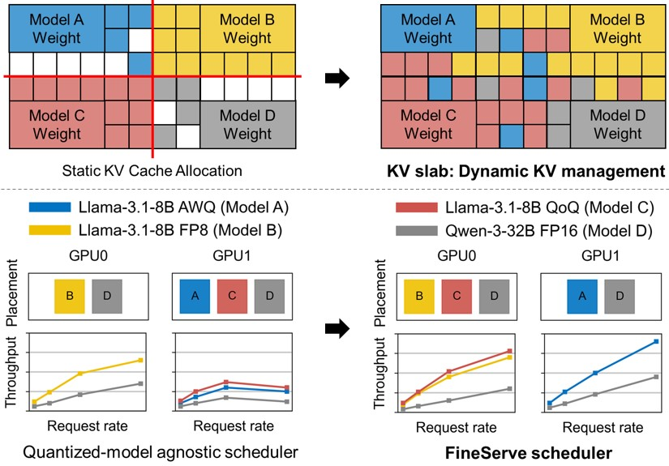

# FineServe: Precision-Aware KV Slab and Two-Level Scheduling for Heterogeneous Precision LLM Serving
FineServe is an inference serving framework for mixed-precision LLMs. FineServe’s key contributions include: (1) KV Slab, a precision-aware adaptive memory management technique dynamically allocating KV cache based on model quantization
characteristics, significantly reducing GPU memory fragmentation, and (2) a two-level scheduling framework comprising a global scheduler that places models to GPUs based on request
rates, latency SLOs, and memory constraints and efficiency, and a local scheduler that adaptively adjusts batch sizes according to real-time request fluctuations.
<p align="center">
  
</p>

## Installation


### Download Fineserve and required files
Download the code and related files from this repo. The patch files will be under a directory called 'FineServe/patches'
(*TODO: Replace OUR_REPO after code is made public)

```
git clone https://github.com/OUR_REPO/FineServe.git
```


### Prerequisites 1) vLLM

FineServe uses vLLM as the default inference engine. 
Please follow the instructions to apply our patches and install our modified v0.9.1 [vLLM](https://github.com/vllm-project/vllm/releases/tag/v0.9.1)


```shell
git clone --branch v0.9.1 https://github.com/vllm-project/vllm.git
cp FineServe/patches/vllm_fineserve_patch.patch vllm/
cd vllm
git apply vllm_fineserve_patch.patch
python3 use_existing_torch.py ##(Optional: Use this command if you have a pre-installed torch version you want to use)
pip install -r requirements/common.txt
pip install -r requirements/build.txt
export VLLM_PRECOMPILED_WHEEL_LOCATION=YOUR/PATH/TO/PRECOMPILED/WHEEL (##Optional: Skip this command if you wish to compile from scratch)
pip install -e --no-build-isolation .  # This may take 40-50 minutes.
```

### Prerequisites 2) Omniserve
We also use models that are quantized by the [Omniserve](https://github.com/mit-han-lab/omniserve) package.
Download Omniserve and apply the patch we have provided with the following commands:
```shell
git clone https://github.com/mit-han-lab/omniserve.git
cp FineServe/patches/omniserve_fineserve_patch.patch omniserve/
cd omniserve
git apply omniserve_fineserve_patch.patch
```

After applying the patch, install Omniserve and required subpackages, including flash_attn, block_sparse_attn and CUDA kernels.  </u>,
Please refer to the **"Installation" Section** from [Omniserve](https://github.com/mit-han-lab/omniserve) git repo.

#### Install FineServe from source

```shell
cd FineServe
pip install -r requirements.txt
pip install -e .
```

## Getting Started

We have provided step-by-step example for serving multiple quantized LLMs with FineServe.

### 1. Prepare Model Config Yaml File 

We have provided an example model configuration file which is required to run two LLMs on a single GPU, which is `examples/fineserve-2models.yaml`. 
You should change the model checkpoint path inside the file from `/home/jovyan/shared-dir/hpclab/hub/llama-3.1-8b` into `your/path/to/llama-3.1-8b`.

### 2. Run Global Placement
Run the provided script with the command below. \
Please replace *ROOT_DIR* with the actual root directory of the FineServe repo.
```shell
bash scripts/run_placement.sh
```
### 3. Generate Workload File
Generate the workload file with the following command.

```shell
python3 fineserve/utils/workload_utils.py \
    --dataset-source /your/path/to/ShareGPT_V3_unfiltered_cleaned_split.json \
    --output-file /your/desired/path/to/workload_json_file.json \ 
    --model-yaml examples/fineserve-2models.yaml
```

### 4. Setup and start MPS

FineServe uses NVIDIA MPS to manage SM resources of each GPU. \
We can start the MPS service with the following command:

```shell
sudo bash scripts/start_mps.sh
```

After starting the MPS service, we can find `nvidia-log` and `nvidia-mps` directories in `examples/basic/mps`.

### 5. Run FineServe and Workload

Run the provided example with the script [scripts/run_example.sh](scripts/run_example.sh). \
The script execute the following steps: 1) launch the resource managers (KV Slab Managers)  2) launch scheduler configured with the global placement results and workload configuration. 

```shell
bash scripts/run_example.sh
```

The experiment will take upto 5 minutes. If the experiment has been executed successfully, you will see a directory called 'simple_example-results' from the root directory.
There will be a file called 'simple_example_fineserve.log' and the file will contain useful info such as the execution and statistics of the executed prompts. 


### 6. Stop MPS

Stop the NVIDIA MPS Service after you have executed every prompt in the workload with the following command:
```bash
sudo bash scripts/stop_mps.sh
```

## Reference
If FineServe has been useful to you, please make sure to cite our [paper](https://arxiv.org/abs/2509.06261) as following!

```
@misc{bin2025fineserveprecisionawarekvslab,
      title={FineServe: Precision-Aware KV Slab and Two-Level Scheduling for Heterogeneous Precision LLM Serving}, 
      author={Kyungmin Bin and Seungbeom Choi and Jimyoung Son and Jieun Choi and Daseul Bae and Daehyeon Baek and Kihyo Moon and Minsung Jang and Hyojung Lee},
      year={2025},
      eprint={2509.06261},
      archivePrefix={arXiv},
      primaryClass={cs.DC},
      url={https://arxiv.org/abs/2509.06261}, 
}
```
